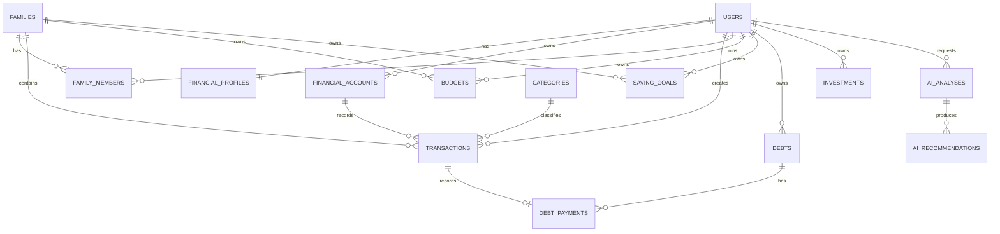

# PRD - Aplikasi Kelola Keuangan Keluarga dan Perorangan Berbasis AI

Versi: 1.0  
Tanggal: 29 Juni 2026  
Status: Draft awal untuk validasi kebutuhan  
Target tech stack: Laravel 13, React 19, Inertia 3, PWA, PHP 8.3-8.5

## 1. Ringkasan Produk

### 1.1 Nama Produk Sementara

Kelola Keuangan Keluarga

### 1.2 Deskripsi Singkat

Aplikasi web untuk membantu pengguna perorangan, pasangan, keluarga, dan admin keluarga mengelola pemasukan, pengeluaran, tabungan, target finansial, kebutuhan bulanan, utang, investasi, dan laporan keuangan. Aplikasi dilengkapi AI financial assistant yang menganalisis pola transaksi, pendapatan bulanan, kategori pengeluaran, kebutuhan wajib, dan target tabungan untuk memberikan rekomendasi penghematan yang realistis, personal, dan dapat ditindaklanjuti.

### 1.3 Problem Statement

Banyak orang dan keluarga mencatat keuangan secara manual, terpisah, atau tidak konsisten. Akibatnya:

- Tidak tahu uang habis untuk kategori apa.
- Sulit melihat pengeluaran terbesar per bulan.
- Sulit membedakan kebutuhan wajib, kebutuhan fleksibel, gaya hidup, dan pemborosan.
- Tidak punya target tabungan yang realistis berdasarkan pendapatan dan pengeluaran aktual.
- Tidak tahu bagian mana yang bisa dihemat tanpa mengganggu kebutuhan utama.
- Admin keluarga sulit memantau transaksi anggota keluarga secara transparan.
- Rekomendasi investasi atau alokasi dana sering tidak berbasis cash flow aktual.

### 1.4 Product Vision

Menjadi aplikasi keuangan pribadi dan keluarga yang bukan hanya mencatat transaksi, tetapi juga membantu mengambil keputusan finansial harian melalui analisis data dan rekomendasi AI yang mudah dipahami.

### 1.5 Tujuan Produk

- Memudahkan pencatatan pemasukan dan pengeluaran harian.
- Memberikan dashboard keuangan yang jelas untuk individu dan keluarga.
- Menampilkan pengeluaran terbesar berdasarkan kategori, anggota, akun, periode, dan merchant.
- Membantu pengguna menentukan nominal tabungan bulanan yang realistis.
- Membantu pengguna memahami kebutuhan wajib, kebutuhan fleksibel, dan pengeluaran yang bisa ditekan.
- Memberikan rekomendasi penghematan berbasis data bulanan.
- Memberikan insight awal untuk dana darurat, utang, investasi, dan tujuan finansial.
- Memberikan kontrol admin untuk melihat laporan seluruh anggota keluarga sesuai hak akses.
- Menyediakan fondasi sistem yang aman, scalable, dan siap dikembangkan dengan Laravel terbaru.

## 2. Scope Produk

### 2.1 In Scope

- Manajemen akun pengguna.
- Manajemen keluarga atau grup keuangan.
- Role dan permission.
- Pencatatan pemasukan.
- Pencatatan pengeluaran.
- Kategori transaksi.
- Dompet, rekening, e-wallet, kartu kredit, dan akun investasi.
- Budget bulanan.
- Target tabungan.
- Dana darurat.
- Utang dan cicilan yang otomatis masuk perhitungan pengeluaran wajib.
- Investasi manual.
- Dashboard individu.
- Dashboard admin keluarga.
- Laporan bulanan dan tahunan.
- Analisis pengeluaran terbesar.
- AI rekomendasi penghematan.
- AI analisis cash flow.
- AI rekomendasi alokasi tabungan.
- AI analisis kebutuhan.
- AI insight investasi berbasis profil risiko.
- Export laporan.
- Notifikasi dan reminder.
- Progressive Web App agar aplikasi bisa dipasang ke Home Screen Android dan iPhone.
- Audit log aktivitas penting.

### 2.2 Out of Scope untuk MVP

- Integrasi langsung ke bank melalui open banking.
- Eksekusi transaksi investasi langsung dari aplikasi.
- Robo-advisor yang memberikan instruksi beli atau jual instrumen spesifik.
- Pembayaran tagihan langsung.
- OCR struk belanja otomatis.
- Mobile native app.
- Multi-currency kompleks dengan kurs real-time.
- Payroll perusahaan.

Catatan: mobile native app di luar scope MVP, tetapi PWA masuk scope agar aplikasi website bisa di-install ke perangkat mobile dan iPhone.

## 3. Target Pengguna

### 3.1 Pengguna Perorangan

Pengguna yang ingin mencatat dan menganalisis keuangan pribadi.

Kebutuhan utama:

- Mencatat pemasukan dan pengeluaran.
- Melihat sisa uang bulan ini.
- Melihat pengeluaran terbesar.
- Mendapat rekomendasi hemat.
- Menentukan target tabungan.
- Melihat kemampuan investasi.

### 3.2 Pasangan atau Keluarga

Pengguna yang ingin mengelola keuangan bersama dalam satu grup.

Kebutuhan utama:

- Setiap anggota bisa mencatat transaksi sendiri.
- Admin keluarga bisa melihat transaksi dan laporan keseluruhan.
- Bisa memisahkan transaksi pribadi dan transaksi bersama.
- Bisa melihat kontribusi pemasukan dan pengeluaran tiap anggota.
- Bisa membuat budget keluarga.
- Bisa membuat target bersama, misalnya dana darurat, rumah, pendidikan, liburan, kendaraan.

### 3.3 Admin Keluarga

User yang mengelola grup keluarga.

Kebutuhan utama:

- Melihat seluruh pemasukan dan pengeluaran keluarga.
- Melihat pengeluaran terbesar berdasarkan kategori dan anggota.
- Mengatur kategori, budget, target tabungan, dan anggota.
- Memberikan akses ke anggota.
- Melihat laporan keuangan keluarga.

### 3.4 Super Admin Platform

Admin internal aplikasi.

Kebutuhan utama:

- Mengelola user dan paket layanan.
- Melihat statistik penggunaan aplikasi.
- Melakukan troubleshooting data dengan akses terbatas dan diaudit.
- Tidak boleh bebas melihat data sensitif tanpa alasan operasional yang jelas.

Catatan keamanan: akses super admin ke data finansial user harus dibatasi dengan permission, audit log, masking data, dan kebijakan privasi.

## 4. Persona

### 4.1 Persona A - Karyawan Perorangan

Nama: Andi  
Pendapatan: gaji bulanan tetap  
Masalah: sering tidak tahu uang habis untuk apa  
Goal: tahu pengeluaran terbesar, punya target tabungan, dan mengurangi belanja tidak perlu.

### 4.2 Persona B - Pasangan Muda

Nama: Raka dan Dini  
Pendapatan: dua sumber pemasukan  
Masalah: pengeluaran rumah tangga bercampur dengan pengeluaran pribadi  
Goal: transparansi pengeluaran bersama dan target dana darurat.

### 4.3 Persona C - Orang Tua dengan Anak

Nama: Sari  
Pendapatan: gaji dan usaha sampingan  
Masalah: biaya pendidikan, belanja bulanan, cicilan, dan tabungan sering tidak terkontrol  
Goal: tahu kebutuhan prioritas dan membuat rencana tabungan pendidikan.

### 4.4 Persona D - Admin Keluarga

Nama: Budi  
Peran: kepala keluarga atau pengelola keuangan keluarga  
Masalah: sulit memantau semua pemasukan dan pengeluaran anggota  
Goal: melihat laporan keluarga lengkap dan mendapatkan rekomendasi penghematan keluarga.

## 5. Role dan Hak Akses

### 5.1 Role Aplikasi

| Role | Deskripsi |
| --- | --- |
| User | Pengguna biasa yang mengelola keuangan pribadi. |
| Family Member | Anggota grup keluarga. |
| Family Admin | Admin grup keluarga yang mengelola data keluarga. |
| Family Viewer | Anggota yang hanya boleh melihat laporan tertentu. |
| Super Admin | Admin internal platform. |

### 5.2 Permission Utama

| Fitur | User | Family Member | Family Admin | Family Viewer | Super Admin |
| --- | --- | --- | --- | --- | --- |
| Kelola transaksi pribadi | Ya | Ya | Ya | Tidak | Tidak langsung |
| Kelola transaksi keluarga | Tidak | Sesuai akses | Ya | Tidak | Tidak langsung |
| Lihat laporan pribadi | Ya | Ya | Ya | Sesuai akses | Agregat |
| Lihat laporan keluarga | Tidak | Sesuai akses | Ya | Ya | Agregat |
| Kelola anggota keluarga | Tidak | Tidak | Ya | Tidak | Tidak |
| Kelola kategori keluarga | Tidak | Tidak | Ya | Tidak | Tidak |
| Kelola user platform | Tidak | Tidak | Tidak | Tidak | Ya |
| Lihat audit log | Pribadi | Terbatas | Keluarga | Tidak | Ya |

### 5.3 Aturan Privasi Data Keluarga

- Transaksi dapat diberi visibility: `private`, `family`, atau `shared_goal`.
- Family Admin dapat melihat transaksi `family` dan transaksi anggota yang disetujui untuk dibagikan.
- Transaksi `private` tetap hanya terlihat oleh pemilik, kecuali user mengubah permission.
- Laporan keluarga memakai data yang dibagikan ke keluarga.
- AI keluarga hanya menganalisis data yang memiliki izin untuk dianalisis dalam konteks keluarga.

## 6. Fitur Utama

### 6.1 Authentication dan Onboarding

Prioritas: P0

Deskripsi:

Pengguna dapat membuat akun, login, logout, reset password, verifikasi email, dan onboarding profil keuangan awal.

Kebutuhan:

- Register dengan nama, email, password.
- Login email dan password.
- Verifikasi email.
- Reset password.
- Onboarding tipe akun: perorangan atau keluarga.
- Onboarding pendapatan rata-rata.
- Onboarding tujuan utama: hemat, tabungan, dana darurat, bayar utang, investasi, kontrol keluarga.
- Onboarding profil risiko investasi: konservatif, moderat, agresif.
- Onboarding status finansial: punya utang, punya cicilan, punya dana darurat, punya investasi.

Acceptance Criteria:

- User baru dapat menyelesaikan registrasi dan onboarding.
- User tidak dapat mengakses dashboard sebelum email diverifikasi jika kebijakan verifikasi aktif.
- Data onboarding tersimpan dan digunakan untuk rekomendasi awal AI.

### 6.2 Manajemen Profil Keuangan

Prioritas: P0

Deskripsi:

User dapat mengatur informasi dasar yang mempengaruhi analisis keuangan.

Field:

- Nama.
- Status: perorangan, menikah, keluarga.
- Jumlah tanggungan.
- Mata uang utama.
- Pendapatan bulanan estimasi.
- Tanggal awal periode keuangan bulanan.
- Profil risiko investasi.
- Target rasio tabungan.
- Target dana darurat dalam bulan pengeluaran.

Acceptance Criteria:

- User dapat mengubah profil keuangan.
- Perubahan profil mempengaruhi rekomendasi berikutnya.
- Riwayat perubahan profil penting disimpan dalam audit log.

### 6.3 Family atau Household Management

Prioritas: P0

Deskripsi:

User dapat membuat grup keluarga untuk mengelola keuangan bersama.

Kebutuhan:

- Membuat keluarga.
- Mengundang anggota melalui email atau kode undangan.
- Mengatur role anggota.
- Mengatur permission visibility data.
- Menghapus anggota.
- Transfer ownership admin keluarga.
- Mengatur budget dan target keluarga.

Acceptance Criteria:

- Pembuat keluarga otomatis menjadi Family Admin.
- Anggota yang diundang harus menerima undangan sebelum masuk keluarga.
- Admin dapat mengubah role anggota.
- User dapat keluar dari keluarga jika bukan satu-satunya admin.

### 6.4 Manajemen Akun Keuangan

Prioritas: P0

Deskripsi:

User dapat membuat sumber dana atau akun untuk memisahkan uang.

Jenis akun:

- Cash.
- Bank account.
- E-wallet.
- Credit card.
- Loan account.
- Investment account.
- Savings goal account.

Field:

- Nama akun.
- Jenis akun.
- Saldo awal.
- Saldo saat ini.
- Mata uang.
- Pemilik akun.
- Visibility.
- Status aktif atau arsip.

Acceptance Criteria:

- User dapat membuat, mengubah, dan mengarsipkan akun.
- Saldo akun berubah otomatis saat transaksi dibuat.
- Akun yang sudah punya transaksi tidak boleh dihapus permanen, hanya diarsipkan.

### 6.5 Kategori Transaksi

Prioritas: P0

Deskripsi:

Kategori dipakai untuk mengelompokkan pemasukan dan pengeluaran.

Kategori default pengeluaran:

- Makanan dan minuman.
- Belanja bulanan.
- Transportasi.
- Tempat tinggal.
- Listrik, air, internet.
- Pendidikan.
- Kesehatan.
- Anak dan keluarga.
- Cicilan dan utang.
- Hiburan.
- Belanja pribadi.
- Donasi.
- Langganan.
- Pajak dan administrasi.
- Investasi.
- Tabungan.
- Lainnya.

Kategori default pemasukan:

- Gaji.
- Bonus.
- Usaha.
- Freelance.
- Hadiah.
- Investasi.
- Penjualan aset.
- Lainnya.

Atribut kategori:

- Nama.
- Tipe: income atau expense.
- Parent category.
- Warna.
- Icon.
- Apakah kebutuhan wajib.
- Apakah bisa dihemat.
- Apakah termasuk gaya hidup.
- Apakah termasuk investasi atau tabungan.

Acceptance Criteria:

- Sistem menyediakan kategori default saat user baru dibuat.
- User dapat membuat kategori custom.
- Kategori default tidak boleh dihapus jika masih digunakan.
- AI dapat memakai atribut kategori untuk analisis kebutuhan dan rekomendasi hemat.

### 6.6 Pencatatan Pemasukan

Prioritas: P0

Deskripsi:

User dapat mencatat pendapatan atau pemasukan.

Field:

- Tanggal.
- Nominal.
- Akun tujuan.
- Kategori pemasukan.
- Deskripsi.
- Sumber pemasukan.
- Apakah berulang.
- Periode berulang.
- Visibility.
- Lampiran opsional.

Acceptance Criteria:

- Pemasukan menambah saldo akun tujuan.
- Pemasukan berulang dapat dibuat otomatis sesuai jadwal.
- Pemasukan dapat difilter berdasarkan periode, kategori, akun, dan anggota.

### 6.7 Pencatatan Pengeluaran

Prioritas: P0

Deskripsi:

User dapat mencatat pengeluaran.

Field:

- Tanggal.
- Nominal.
- Akun sumber.
- Kategori pengeluaran.
- Deskripsi.
- Merchant atau penerima.
- Tag.
- Apakah berulang.
- Periode berulang.
- Visibility.
- Lampiran opsional.
- Status kebutuhan: wajib, fleksibel, gaya hidup, tidak terklasifikasi.

Acceptance Criteria:

- Pengeluaran mengurangi saldo akun sumber.
- User mendapat peringatan jika transaksi melebihi saldo akun cash/bank.
- Pengeluaran berulang dapat dibuat otomatis sesuai jadwal.
- Pengeluaran dapat difilter berdasarkan periode, kategori, akun, anggota, tag, dan merchant.

### 6.8 Transfer Antar Akun

Prioritas: P0

Deskripsi:

User dapat memindahkan uang dari satu akun ke akun lain tanpa dihitung sebagai pemasukan atau pengeluaran.

Contoh:

- Transfer dari bank ke e-wallet.
- Transfer dari rekening utama ke rekening tabungan.
- Transfer ke akun investasi.

Acceptance Criteria:

- Transfer mengurangi saldo akun sumber dan menambah saldo akun tujuan.
- Transfer tidak masuk total pemasukan atau pengeluaran.
- Transfer ke savings goal dapat dihitung sebagai progres tabungan.

### 6.9 Budget Bulanan

Prioritas: P0

Deskripsi:

User dapat membuat batas pengeluaran per kategori per bulan.

Kebutuhan:

- Budget per kategori.
- Budget total bulanan.
- Budget pribadi.
- Budget keluarga.
- Notifikasi saat mencapai 50%, 80%, 100%, dan melewati budget.
- Rekomendasi AI untuk budget bulan depan.

Acceptance Criteria:

- Sistem menghitung pemakaian budget berdasarkan transaksi pada periode berjalan.
- User dapat melihat kategori yang mendekati atau melewati budget.
- AI dapat memberi rekomendasi perubahan budget berdasarkan riwayat 3-6 bulan.

### 6.10 Target Tabungan

Prioritas: P0

Deskripsi:

User dapat membuat tujuan tabungan dan memantau progresnya.

Contoh target:

- Dana darurat.
- Rumah.
- Kendaraan.
- Pendidikan anak.
- Liburan.
- Pernikahan.
- Gadget.
- Modal usaha.
- Investasi awal.

Field:

- Nama target.
- Nominal target.
- Saldo saat ini.
- Tanggal target.
- Prioritas.
- Akun tujuan.
- Kontribusi bulanan disarankan.
- Status: aktif, tercapai, ditunda, dibatalkan.

Acceptance Criteria:

- Sistem menghitung kekurangan target.
- Sistem menghitung nominal tabungan per bulan yang dibutuhkan.
- AI memberi rekomendasi apakah target realistis berdasarkan cash flow.
- Jika target tidak realistis, AI memberi opsi: kurangi target, perpanjang waktu, tambah pendapatan, atau hemat kategori tertentu.

### 6.11 Dana Darurat

Prioritas: P1

Deskripsi:

Sistem membantu user menghitung kebutuhan dana darurat berdasarkan pengeluaran wajib bulanan.

Formula awal:

- Kebutuhan dana darurat = rata-rata pengeluaran wajib bulanan x target bulan dana darurat.
- Target default: 3 bulan untuk single, 6 bulan untuk keluarga, dapat diubah user.

Acceptance Criteria:

- User dapat melihat target dana darurat.
- Sistem menghitung progress dana darurat.
- AI menyarankan kontribusi bulanan berdasarkan kemampuan cash flow.

### 6.12 Utang dan Cicilan

Prioritas: P0

Deskripsi:

User dapat mencatat utang, pinjaman, kartu kredit, cicilan, dan kewajiban pembayaran lain. Sistem harus menghitung total utang, sisa utang, total cicilan per bulan, jatuh tempo pembayaran, dan memasukkan cicilan yang harus dibayar ke perhitungan pengeluaran wajib bulanan.

Field:

- Nama utang.
- Jenis utang: pinjaman pribadi, kartu kredit, paylater, KPR, KKB, cicilan barang, pinjaman usaha, lainnya.
- Pemberi pinjaman.
- Total pinjaman.
- Sisa pokok.
- Cicilan bulanan atau minimum payment.
- Bunga.
- Tanggal mulai.
- Tenor.
- Sisa tenor.
- Jatuh tempo bulanan.
- Tanggal jatuh tempo berikutnya.
- Tanggal lunas estimasi.
- Akun pembayaran.
- Kategori pengeluaran.
- Apakah otomatis membuat transaksi pengeluaran bulanan.
- Apakah dihitung sebagai pengeluaran wajib.
- Status.

Acceptance Criteria:

- Cicilan bulanan masuk ke pengeluaran wajib dan mengurangi cash flow bulan berjalan.
- Sistem menampilkan total utang awal, total sisa utang, total cicilan bulan ini, total cicilan yang sudah dibayar, dan cicilan yang belum dibayar.
- Saat pembayaran hutang dicatat, sistem membuat transaksi pengeluaran dengan kategori `Cicilan dan Utang`.
- Jika user mengaktifkan auto-generate, sistem membuat transaksi pengeluaran otomatis pada tanggal jatuh tempo.
- Jika cicilan dibayar sebagian, sistem mencatat sisa tagihan bulan tersebut.
- Jika user melunasi lebih cepat, sistem memperbarui sisa pokok dan estimasi tanggal lunas.
- Sistem menampilkan total utang dan rasio cicilan terhadap pendapatan.
- Sistem menampilkan daftar hutang yang jatuh tempo dalam 7 hari, 14 hari, dan 30 hari.
- AI memberi peringatan jika rasio cicilan terlalu tinggi.
- AI dapat menyarankan strategi prioritas pelunasan: bunga tertinggi dulu atau saldo terkecil dulu.
- AI harus memasukkan total cicilan bulanan sebagai kebutuhan wajib sebelum menyarankan nominal tabungan atau investasi.

### 6.13 Investasi Manual

Prioritas: P1

Deskripsi:

User dapat mencatat aset investasi secara manual.

Jenis investasi:

- Deposito.
- Reksadana.
- Saham.
- Obligasi.
- Emas.
- Crypto.
- Properti.
- Bisnis.
- Lainnya.

Field:

- Nama aset.
- Jenis aset.
- Modal awal.
- Nilai saat ini.
- Tanggal pembelian.
- Profil risiko.
- Catatan.

Acceptance Criteria:

- User dapat melihat total nilai investasi.
- User dapat melihat perubahan nilai investasi manual.
- AI hanya memberi insight edukatif dan alokasi umum, bukan instruksi beli atau jual aset spesifik.

### 6.14 Dashboard Individu

Prioritas: P0

Deskripsi:

Dashboard utama untuk user perorangan.

Komponen:

- Total saldo.
- Total pemasukan bulan ini.
- Total pengeluaran bulan ini.
- Cash flow bersih.
- Sisa budget bulan ini.
- Progress tabungan.
- Pengeluaran terbesar.
- Kategori yang melewati budget.
- Rekomendasi AI ringkas.
- Trend pemasukan dan pengeluaran 6 bulan.
- Rasio tabungan.
- Rasio cicilan.
- Total cicilan/hutang bulan ini.
- Hutang jatuh tempo terdekat.
- Dana darurat.
- Quick Menu untuk akses cepat ke transaksi, akun, kategori, budget, tabungan, hutang, laporan, AI Insight, dan keluarga.

Acceptance Criteria:

- Dashboard memuat data berdasarkan periode default bulan berjalan.
- User dapat mengganti periode.
- Data visual ditampilkan dengan chart yang mudah dipahami.
- Pengeluaran terbesar dapat dilihat berdasarkan kategori, merchant, dan akun.
- Setiap item Quick Menu dapat diklik dan mengarah ke halaman fitur yang sesuai.

### 6.15 Dashboard Keluarga atau Admin

Prioritas: P0

Deskripsi:

Dashboard untuk Family Admin melihat kondisi keluarga.

Komponen:

- Total pemasukan keluarga.
- Total pengeluaran keluarga.
- Cash flow keluarga.
- Kontribusi pemasukan per anggota.
- Pengeluaran per anggota.
- Pengeluaran terbesar keluarga.
- Budget keluarga.
- Target tabungan keluarga.
- Total cicilan/hutang keluarga bulan ini.
- Hutang keluarga jatuh tempo terdekat.
- Transaksi terbaru.
- Kategori paling boros.
- Rekomendasi AI keluarga.

Acceptance Criteria:

- Admin hanya melihat data yang diizinkan sesuai permission.
- Data pribadi anggota yang tidak dibagikan tidak muncul.
- Admin dapat memfilter laporan berdasarkan anggota, kategori, akun, dan periode.

### 6.16 Laporan dan Analitik

Prioritas: P0

Jenis laporan:

- Laporan pemasukan.
- Laporan pengeluaran.
- Laporan cash flow.
- Laporan kategori.
- Laporan anggota keluarga.
- Laporan budget.
- Laporan tabungan.
- Laporan utang.
- Laporan investasi.
- Laporan perbandingan bulan ke bulan.
- Laporan pengeluaran terbesar.

Filter:

- Periode.
- Kategori.
- Akun.
- Anggota.
- Visibility.
- Tag.
- Merchant.

Output:

- Tabel.
- Chart.
- Export PDF.
- Export Excel/CSV.

Acceptance Criteria:

- User dapat melihat ringkasan dan detail transaksi.
- Export mengikuti filter yang dipilih.
- Laporan keluarga menghormati permission data.

### 6.17 AI Financial Assistant

Prioritas: P0

Deskripsi:

AI membantu user memahami kondisi keuangan, mencari peluang penghematan, menentukan target tabungan, dan menyusun rekomendasi pengelolaan uang.

Prinsip utama:

- AI harus berbasis data transaksi user.
- AI tidak boleh mengarang nominal yang tidak ada di data.
- AI harus membedakan fakta, asumsi, dan rekomendasi.
- AI harus memberi rekomendasi yang bisa ditindaklanjuti.
- AI tidak boleh memberikan jaminan hasil investasi.
- AI harus menjelaskan alasan rekomendasi secara singkat.

#### 6.17.1 Analisis Bulanan

Input:

- Pemasukan bulan berjalan.
- Pemasukan rata-rata 3-6 bulan.
- Pengeluaran bulan berjalan.
- Pengeluaran rata-rata 3-6 bulan.
- Budget.
- Kategori.
- Target tabungan.
- Cicilan.
- Dana darurat.

Output:

- Ringkasan kondisi bulan ini.
- Apakah cash flow positif atau negatif.
- Pengeluaran terbesar.
- Kategori naik signifikan.
- Kategori yang masih aman.
- Kategori yang perlu ditekan.
- Estimasi uang yang bisa ditabung.
- Rekomendasi tindakan untuk bulan depan.

Acceptance Criteria:

- AI dapat menghasilkan analisis bulanan berdasarkan data aktual.
- AI menyebutkan nominal dan kategori yang relevan.
- AI memberikan minimal 3 rekomendasi penghematan jika ada pengeluaran fleksibel.

#### 6.17.2 Rekomendasi Penghematan

Tujuan:

Menentukan berapa uang yang bisa dihemat dan dari kategori mana.

Logika awal:

- Hitung pengeluaran wajib.
- Hitung pengeluaran fleksibel.
- Hitung pengeluaran gaya hidup.
- Bandingkan dengan rata-rata 3 bulan.
- Cari kategori yang naik lebih dari threshold.
- Cari kategori yang melewati budget.
- Cari transaksi berulang yang tidak penting.
- Buat rekomendasi penghematan bertahap.

Contoh output:

- "Pengeluaran makanan di luar rumah bulan ini Rp1.800.000, naik 35% dari rata-rata 3 bulan. Target hemat realistis: Rp300.000-Rp450.000."
- "Langganan digital total Rp250.000 per bulan. Jika 2 layanan dihentikan, potensi hemat Rp100.000-Rp150.000."
- "Target tabungan Rp1.000.000 masih realistis jika pengeluaran hiburan ditekan 20%."

Acceptance Criteria:

- Rekomendasi menyebutkan kategori, nominal saat ini, nominal hemat, dan alasan.
- Rekomendasi tidak boleh memangkas kebutuhan wajib secara agresif.
- User dapat menandai rekomendasi sebagai diterima, ditolak, atau selesai.

#### 6.17.3 Analisis Kebutuhan

Tujuan:

Membedakan kebutuhan wajib, kebutuhan fleksibel, gaya hidup, tabungan, investasi, dan utang.

Klasifikasi:

- Wajib: tempat tinggal, makan pokok, listrik, air, internet kerja/sekolah, pendidikan, kesehatan, cicilan minimum.
- Fleksibel: transportasi non-esensial, belanja bulanan yang bisa dioptimalkan, makan di luar.
- Gaya hidup: hiburan, langganan, belanja impulsif, liburan, gadget non-prioritas.
- Finansial: tabungan, investasi, dana darurat, asuransi.

Acceptance Criteria:

- User dapat melihat komposisi kebutuhan dalam persen dari pendapatan.
- AI dapat menjelaskan kategori mana yang sehat dan mana yang perlu dikurangi.
- User dapat mengubah klasifikasi jika hasil AI tidak sesuai konteks.

#### 6.17.4 Rekomendasi Tabungan

Tujuan:

Memberi saran nominal tabungan berdasarkan cash flow aktual.

Formula awal:

- Pendapatan tersedia = total pemasukan - pengeluaran wajib - cicilan minimum.
- Kapasitas tabungan = pendapatan tersedia - pengeluaran fleksibel minimum realistis.
- Rekomendasi tabungan = nilai yang aman di antara target user dan kapasitas tabungan.

Output:

- Nominal tabungan minimum.
- Nominal tabungan ideal.
- Nominal tabungan agresif.
- Dampak terhadap budget kategori lain.
- Estimasi tanggal target tercapai.

Acceptance Criteria:

- AI dapat menyarankan nominal tabungan bulanan.
- AI memberi opsi konservatif, realistis, dan agresif.
- AI menjelaskan konsekuensi setiap opsi.

#### 6.17.5 Rekomendasi Dana Darurat

Tujuan:

Membantu user membangun dana darurat.

Output:

- Target dana darurat.
- Kekurangan dana darurat.
- Rekomendasi setoran bulanan.
- Estimasi waktu tercapai.
- Prioritas dibanding investasi.

Acceptance Criteria:

- Jika dana darurat belum mencukupi, AI menyarankan prioritas dana darurat sebelum investasi agresif.
- Jika dana darurat sudah mencukupi, AI dapat menyarankan alokasi ke investasi sesuai profil risiko.

#### 6.17.6 Insight Investasi

Tujuan:

Memberikan edukasi dan alokasi umum berdasarkan profil risiko dan cash flow.

Batasan:

- Tidak memberi jaminan return.
- Tidak menyuruh beli atau jual aset spesifik.
- Tidak menggantikan penasihat keuangan profesional.
- Harus menampilkan disclaimer.

Output:

- Profil risiko user.
- Kemampuan investasi bulanan.
- Prioritas sebelum investasi: dana darurat, utang berbunga tinggi, kebutuhan bulanan.
- Contoh alokasi umum: konservatif, moderat, agresif.
- Risiko yang perlu dipahami.

Acceptance Criteria:

- AI tidak memberikan rekomendasi aset spesifik sebagai instruksi final.
- AI memberi edukasi dan opsi alokasi umum.
- User harus menyetujui disclaimer sebelum memakai fitur insight investasi.

#### 6.17.7 Chat AI Keuangan

Prioritas: P1

Deskripsi:

User dapat bertanya ke AI mengenai kondisi keuangan pribadi atau keluarga.

Contoh pertanyaan:

- "Bulan ini pengeluaran terbesar saya apa?"
- "Berapa yang bisa saya tabung bulan depan?"
- "Kategori apa yang paling boros?"
- "Apakah target dana darurat saya realistis?"
- "Apa yang bisa saya hemat dari pengeluaran keluarga?"
- "Apakah saya sudah aman untuk mulai investasi?"

Acceptance Criteria:

- Chat AI hanya menjawab berdasarkan data yang user izinkan.
- AI menyebutkan periode data yang digunakan.
- AI dapat menolak menjawab jika data belum cukup.

#### 6.17.8 AI Klasifikasi Transaksi

Prioritas: P1

Deskripsi:

AI membantu mengklasifikasikan kategori transaksi dari deskripsi atau merchant.

Acceptance Criteria:

- Sistem memberi saran kategori saat user mengetik deskripsi.
- User tetap bisa mengubah kategori.
- Sistem belajar dari koreksi user.

#### 6.17.9 AI Deteksi Anomali

Prioritas: P1

Deskripsi:

AI dan rule engine mendeteksi transaksi tidak biasa.

Contoh:

- Pengeluaran kategori makanan naik 50%.
- Transaksi besar di luar kebiasaan.
- Pengeluaran berulang duplikat.
- Cash flow negatif dua bulan berturut-turut.

Acceptance Criteria:

- User mendapat notifikasi anomali.
- Notifikasi menjelaskan penyebab dan rekomendasi tindakan.

### 6.18 Rekomendasi dan Action Plan

Prioritas: P0

Deskripsi:

Setiap insight AI harus bisa diubah menjadi action plan.

Contoh action:

- Kurangi makan di luar Rp300.000 bulan ini.
- Batalkan langganan yang jarang dipakai.
- Pindahkan Rp500.000 ke tabungan setiap tanggal gajian.
- Batasi transportasi online maksimal Rp400.000.
- Lunasi utang bunga tertinggi terlebih dahulu.

Status action:

- Baru.
- Diterima.
- Berjalan.
- Selesai.
- Ditolak.

Acceptance Criteria:

- User dapat menerima atau menolak rekomendasi.
- Rekomendasi yang diterima masuk daftar action plan.
- Sistem mengevaluasi apakah action berhasil di akhir bulan.

### 6.19 Notifikasi dan Reminder

Prioritas: P1

Jenis notifikasi:

- Reminder input transaksi harian.
- Reminder gajian untuk menabung.
- Reminder jatuh tempo cicilan.
- Budget hampir habis.
- Target tabungan tertinggal.
- Cash flow negatif.
- Anomali pengeluaran.
- Ringkasan mingguan.
- Ringkasan bulanan.

Channel:

- In-app notification.
- Email.
- Push notification jika mobile app sudah tersedia.

Acceptance Criteria:

- User dapat mengatur preferensi notifikasi.
- Notifikasi penting tidak dikirim berulang secara mengganggu.

### 6.20 Export dan Backup

Prioritas: P1

Deskripsi:

User dapat mengunduh data dan laporan.

Format:

- CSV.
- Excel.
- PDF.

Acceptance Criteria:

- User dapat export transaksi berdasarkan filter.
- Admin keluarga dapat export laporan keluarga sesuai permission.
- Export mencatat audit log.

### 6.21 Progressive Web App

Prioritas: P0

Deskripsi:

Aplikasi harus bisa digunakan sebagai website biasa dan bisa dipasang ke Home Screen perangkat Android maupun iPhone sebagai PWA. Tujuannya agar user dapat membuka aplikasi seperti mobile app tanpa harus membuat native Android/iOS app di fase awal.

Kebutuhan:

- Web app manifest.
- App name dan short name.
- App icon berbagai ukuran.
- Splash screen support.
- Theme color.
- Service worker.
- Offline fallback page.
- Cache static asset.
- Cache shell aplikasi untuk halaman utama.
- Detect install prompt di browser yang mendukung.
- Panduan install untuk iPhone karena prosesnya melalui Share lalu Add to Home Screen.
- Responsive layout untuk ukuran mobile.
- Safe area support untuk iPhone.
- PWA-ready login dan authenticated layout.
- Notifikasi in-app tetap berjalan di semua browser.
- Web push notification menjadi P1 karena dukungan dan permission berbeda antar browser/perangkat.
- Online-first data persistence: semua perubahan data dari PWA saat online harus tersimpan ke database server.

Acceptance Criteria:

- User dapat memasang aplikasi ke Home Screen Android dari browser yang mendukung.
- User iPhone dapat memasang aplikasi melalui Add to Home Screen.
- Saat dibuka dari Home Screen, aplikasi tampil dalam mode standalone jika browser mendukung.
- Icon aplikasi tampil benar di Home Screen.
- Aplikasi memiliki offline fallback saat koneksi hilang.
- Halaman dashboard mobile tidak rusak pada ukuran layar kecil.
- PWA tidak menyimpan data finansial sensitif secara sembarangan di browser storage.
- Service worker tidak meng-cache response yang berisi data private tanpa strategi keamanan yang jelas.
- Saat user online, tambah/edit/hapus transaksi, pembayaran hutang, budget, dan target tabungan dari PWA tersimpan ke database Laravel/MySQL.
- Data yang diubah dari PWA terlihat juga saat user membuka website dengan akun yang sama.
- Saat offline, perubahan data finansial tidak boleh ditandai berhasil sebelum benar-benar tersimpan ke server.
- Jika offline submit belum didukung, UI harus menampilkan pesan bahwa data belum tersimpan dan user perlu mencoba lagi saat online.

## 7. User Flow

### 7.1 Flow User Perorangan

1. User register.
2. User verifikasi email.
3. User memilih mode perorangan.
4. User mengisi profil keuangan.
5. User membuat akun keuangan.
6. User mencatat pemasukan.
7. User mencatat pengeluaran.
8. User membuat budget.
9. User membuat target tabungan.
10. User melihat dashboard.
11. User membuka analisis AI.
12. User menerima rekomendasi penghematan.
13. User memantau progres bulan berikutnya.

### 7.2 Flow Admin Keluarga

1. User register.
2. User membuat keluarga.
3. User mengundang anggota.
4. Anggota menerima undangan.
5. Admin mengatur role dan permission.
6. Anggota mencatat transaksi.
7. Admin melihat dashboard keluarga.
8. Admin melihat pengeluaran terbesar keluarga.
9. Admin membuka AI analisis keluarga.
10. Admin membuat action plan keluarga.

### 7.3 Flow AI Rekomendasi Hemat

1. User membuka menu AI Insight.
2. Sistem mengambil data transaksi periode terpilih.
3. Sistem menghitung metrik finansial secara deterministik.
4. Sistem membuat konteks ringkas untuk AI.
5. AI menghasilkan insight dan rekomendasi.
6. Sistem menyimpan hasil analisis.
7. User menerima, menolak, atau menyimpan rekomendasi.
8. Sistem mengevaluasi rekomendasi pada akhir periode.

## 8. Dashboard dan Halaman

### 8.1 Public Pages

- Landing page.
- Login.
- Register.
- Forgot password.
- Reset password.
- Email verification.

### 8.2 User App Pages

- Dashboard.
- Transaksi.
- Tambah transaksi.
- Akun keuangan.
- Kategori.
- Budget.
- Target tabungan.
- Dana darurat.
- Utang.
- Investasi.
- Laporan.
- AI Insight.
- AI Chat.
- Action Plan.
- Pengaturan profil.
- Pengaturan notifikasi.
- Pengaturan PWA dan panduan install aplikasi.

### 8.3 Family Pages

- Dashboard keluarga.
- Anggota keluarga.
- Undangan.
- Permission data.
- Budget keluarga.
- Target keluarga.
- Laporan keluarga.
- AI Insight keluarga.

### 8.4 Admin Platform Pages

- Dashboard platform.
- User management.
- Family management.
- Subscription plan.
- Audit log.
- System settings.
- AI usage monitoring.

### 8.5 PWA System Pages

- Offline fallback.
- Install guide.
- Update available prompt.
- Unsupported browser notice jika fitur tertentu tidak tersedia.

## 9. Data Model Awal

### 9.1 Entities

#### users

- id
- name
- email
- password
- email_verified_at
- status
- created_at
- updated_at

#### financial_profiles

- id
- user_id
- account_type
- monthly_income_estimate
- financial_month_start_day
- dependents_count
- risk_profile
- target_saving_ratio
- emergency_fund_months
- main_goal
- created_at
- updated_at

#### families

- id
- name
- owner_user_id
- currency
- created_at
- updated_at

#### family_members

- id
- family_id
- user_id
- role
- status
- joined_at
- created_at
- updated_at

#### family_invitations

- id
- family_id
- email
- token
- role
- status
- expires_at
- accepted_at
- created_at
- updated_at

#### financial_accounts

- id
- user_id
- family_id
- name
- type
- initial_balance
- current_balance
- currency
- visibility
- is_active
- created_at
- updated_at

#### categories

- id
- user_id
- family_id
- parent_id
- name
- type
- color
- icon
- is_default
- is_essential
- is_savable
- is_lifestyle
- created_at
- updated_at

#### transactions

- id
- user_id
- family_id
- account_id
- category_id
- type
- amount
- transaction_date
- description
- merchant
- visibility
- need_type
- is_recurring
- recurring_rule_id
- metadata
- created_at
- updated_at
- deleted_at

#### transfers

- id
- user_id
- family_id
- from_account_id
- to_account_id
- amount
- transfer_date
- description
- created_at
- updated_at

#### budgets

- id
- user_id
- family_id
- category_id
- period_type
- period_start
- period_end
- amount
- alert_thresholds
- created_at
- updated_at

#### saving_goals

- id
- user_id
- family_id
- account_id
- name
- target_amount
- current_amount
- target_date
- priority
- status
- created_at
- updated_at

#### debts

- id
- user_id
- family_id
- name
- type
- lender
- principal_amount
- outstanding_amount
- monthly_payment
- minimum_payment
- interest_rate
- start_date
- tenor_months
- remaining_tenor_months
- due_day
- next_due_date
- payment_account_id
- category_id
- auto_generate_expense
- include_in_monthly_expense
- status
- created_at
- updated_at

#### debt_payments

- id
- debt_id
- user_id
- family_id
- transaction_id
- payment_account_id
- amount
- principal_amount
- interest_amount
- fee_amount
- due_date
- paid_at
- status
- notes
- created_at
- updated_at

#### investments

- id
- user_id
- family_id
- account_id
- name
- type
- initial_amount
- current_value
- purchase_date
- risk_level
- notes
- created_at
- updated_at

#### ai_analyses

- id
- user_id
- family_id
- period_start
- period_end
- analysis_type
- input_snapshot
- metrics_snapshot
- result_summary
- recommendations
- model_name
- status
- created_at
- updated_at

#### ai_recommendations

- id
- ai_analysis_id
- user_id
- family_id
- type
- title
- description
- category_id
- estimated_saving_amount
- confidence_score
- status
- due_date
- created_at
- updated_at

#### notifications

- id
- user_id
- type
- title
- body
- data
- read_at
- created_at

#### audit_logs

- id
- actor_user_id
- family_id
- action
- entity_type
- entity_id
- old_values
- new_values
- ip_address
- user_agent
- created_at

### 9.2 Relasi Utama

- User memiliki satu financial profile.
- User dapat memiliki banyak financial accounts.
- User dapat menjadi anggota banyak family.
- Family memiliki banyak family members.
- Family memiliki banyak transactions yang visibility-nya keluarga.
- Transaction belongs to user, account, category, dan optional family.
- Budget dapat milik user pribadi atau family.
- Saving goal dapat milik user pribadi atau family.
- Debt memiliki banyak debt payments.
- Debt payment dapat terhubung ke transaction agar pembayaran hutang tetap masuk laporan pengeluaran.
- AI analysis dapat dibuat untuk user pribadi atau family.
- AI recommendation berasal dari AI analysis.

### 9.3 Diagram ERD Konseptual



## 10. Business Rules

### 10.1 Periode Keuangan

- Default periode bulanan dimulai tanggal 1.
- User dapat mengatur tanggal awal periode, misalnya setiap tanggal gajian.
- Semua dashboard dan laporan mengikuti periode yang dipilih.

### 10.2 Saldo Akun

- Pemasukan menambah saldo.
- Pengeluaran mengurangi saldo.
- Transfer mengurangi akun sumber dan menambah akun tujuan.
- Koreksi saldo harus disimpan sebagai adjustment transaction atau audit event.

### 10.3 Budget

- Budget dihitung berdasarkan transaksi expense.
- Transfer tidak mengurangi budget.
- Tabungan dapat dihitung sebagai kategori finansial, bukan pengeluaran konsumtif.
- Budget keluarga hanya menghitung transaksi yang visibility-nya family atau shared.

### 10.4 Pengeluaran Terbesar

Pengeluaran terbesar dapat dihitung berdasarkan:

- Kategori.
- Merchant.
- Anggota.
- Akun.
- Tag.
- Transaksi individual.

Aturan:

- Transfer tidak dihitung sebagai pengeluaran.
- Cicilan dihitung sebagai pengeluaran wajib.
- Investasi dapat dipisahkan dari pengeluaran konsumtif.

### 10.5 Utang dan Cicilan

- Setiap hutang dapat memiliki jadwal cicilan bulanan atau pembayaran manual.
- Cicilan yang jatuh tempo pada periode berjalan dihitung sebagai pengeluaran wajib meskipun belum dibayar.
- Cicilan yang sudah dibayar dibuat sebagai transaksi pengeluaran agar saldo akun berkurang.
- Total pengeluaran bulanan terdiri dari pengeluaran aktual ditambah kewajiban hutang yang jatuh tempo jika laporan memakai mode accrual.
- Untuk laporan cash basis, hanya cicilan yang sudah dibayar yang mengurangi saldo dan cash flow aktual.
- Sistem harus menampilkan dua angka: `cicilan jatuh tempo bulan ini` dan `cicilan sudah dibayar bulan ini`.
- AI wajib memperhitungkan cicilan minimum sebelum memberi rekomendasi tabungan, dana darurat, atau investasi.
- Hutang dengan bunga tinggi diberi prioritas lebih tinggi dalam rekomendasi pelunasan.

### 10.6 Rekomendasi Hemat

AI tidak boleh menyarankan pengurangan ekstrem pada:

- Makanan pokok.
- Kesehatan.
- Pendidikan wajib.
- Cicilan minimum.
- Kebutuhan tempat tinggal.

AI boleh menyarankan optimasi:

- Makan di luar.
- Transportasi non-esensial.
- Hiburan.
- Langganan.
- Belanja impulsif.
- Biaya admin berulang.
- Kategori yang melewati budget.

### 10.7 Rekomendasi Investasi

- Sistem hanya memberi edukasi dan rekomendasi alokasi umum.
- Sistem tidak memberi instruksi final pembelian instrumen spesifik.
- Sistem wajib menampilkan disclaimer.
- Sistem harus mempertimbangkan dana darurat, utang, dan cash flow sebelum menyarankan investasi.

## 11. AI Design

### 11.1 Prinsip Arsitektur AI

AI layer sebaiknya dipisahkan menjadi dua bagian:

- Calculation engine: menghitung metrik finansial secara deterministik.
- Narrative engine: membuat penjelasan, rekomendasi, dan action plan dengan LLM.

Alasan:

- Nominal dan rasio harus akurat.
- AI tidak boleh bebas menghitung angka dari prompt tanpa validasi.
- Output lebih mudah diuji.
- Risiko halusinasi lebih kecil.

### 11.2 Data yang Dikirim ke AI

Data yang boleh dikirim:

- Ringkasan pemasukan.
- Ringkasan pengeluaran per kategori.
- Ringkasan budget.
- Ringkasan target tabungan.
- Ringkasan utang.
- Ringkasan investasi.
- Metrik agregat.
- Transaksi yang sudah dianonimkan jika memungkinkan.

Data yang sebaiknya tidak dikirim mentah:

- Nomor rekening.
- Alamat lengkap.
- Dokumen identitas.
- Data sensitif anggota keluarga tanpa izin.
- Token, password, atau credential.

### 11.3 AI Input Snapshot

Contoh struktur snapshot:

```json
{
  "period": {
    "start": "2026-06-01",
    "end": "2026-06-30"
  },
  "income": {
    "total": 12000000,
    "average_3_months": 11500000
  },
  "expenses": {
    "total": 9800000,
    "average_3_months": 8900000,
    "by_category": [
      {
        "category": "Makanan dan Minuman",
        "amount": 2500000,
        "average_3_months": 1900000,
        "need_type": "flexible"
      }
    ]
  },
  "budgets": {
    "total": 9000000,
    "over_budget_categories": ["Makanan dan Minuman"]
  },
  "saving_goals": [
    {
      "name": "Dana Darurat",
      "target_amount": 30000000,
      "current_amount": 8000000,
      "target_date": "2027-06-30"
    }
  ],
  "debts": {
    "outstanding_total": 45000000,
    "monthly_payment_total": 2000000,
    "paid_this_month": 1500000,
    "unpaid_due_this_month": 500000,
    "nearest_due_date": "2026-06-28",
    "debt_to_income_ratio": 0.17
  }
}
```

### 11.4 AI Output Contract

Output AI harus disimpan dalam format terstruktur.

```json
{
  "summary": "Cash flow bulan ini masih positif, tetapi pengeluaran makanan naik signifikan.",
  "financial_health": {
    "status": "needs_attention",
    "score": 72,
    "reasons": [
      "Rasio tabungan masih di bawah target",
      "Kategori makanan melewati budget"
    ]
  },
  "recommendations": [
    {
      "type": "saving",
      "title": "Kurangi makan di luar",
      "category": "Makanan dan Minuman",
      "current_amount": 2500000,
      "recommended_reduction": 400000,
      "reason": "Naik 31% dari rata-rata 3 bulan",
      "priority": "high"
    }
  ],
  "saving_plan": {
    "minimum": 800000,
    "realistic": 1200000,
    "aggressive": 1800000
  },
  "debt_plan": {
    "monthly_obligation": 2000000,
    "warning": "Rasio cicilan masih aman, tetapi perlu dijaga agar tidak melewati 30% dari pendapatan.",
    "priority": "Bayar cicilan minimum tepat waktu sebelum menambah alokasi investasi."
  },
  "investment_note": "Fokus utama masih dana darurat sebelum meningkatkan investasi agresif."
}
```

### 11.5 Metrik Finansial yang Harus Dihitung

- Total income.
- Total expense.
- Net cash flow.
- Saving ratio.
- Expense ratio.
- Debt to income ratio.
- Total outstanding debt.
- Monthly debt obligation.
- Paid debt amount this month.
- Unpaid due debt amount this month.
- Essential expense ratio.
- Lifestyle expense ratio.
- Budget utilization.
- Emergency fund coverage.
- Largest expense category.
- Month over month change.
- Three month moving average.
- Six month trend.
- Projection for month end.

### 11.6 Guardrails AI

- AI harus menyebutkan jika data tidak cukup.
- AI harus menyebutkan periode analisis.
- AI harus membedakan data aktual dan estimasi.
- AI tidak boleh memberikan klaim investasi pasti.
- AI tidak boleh menyarankan tindakan berisiko tinggi tanpa disclaimer.
- AI tidak boleh membuka data anggota keluarga yang tidak punya permission.
- AI output harus divalidasi schema sebelum disimpan.

## 12. API Requirements

### 12.1 Authentication

- POST /api/register
- POST /api/login
- POST /api/logout
- POST /api/forgot-password
- POST /api/reset-password
- POST /api/email/verification-notification

### 12.2 Profile

- GET /api/me
- PATCH /api/me
- GET /api/financial-profile
- PATCH /api/financial-profile

### 12.3 Families

- GET /api/families
- POST /api/families
- GET /api/families/{family}
- PATCH /api/families/{family}
- DELETE /api/families/{family}
- POST /api/families/{family}/invitations
- POST /api/family-invitations/{token}/accept
- PATCH /api/families/{family}/members/{member}
- DELETE /api/families/{family}/members/{member}

### 12.4 Accounts

- GET /api/accounts
- POST /api/accounts
- GET /api/accounts/{account}
- PATCH /api/accounts/{account}
- DELETE /api/accounts/{account}

### 12.5 Categories

- GET /api/categories
- POST /api/categories
- PATCH /api/categories/{category}
- DELETE /api/categories/{category}

### 12.6 Transactions

- GET /api/transactions
- POST /api/transactions
- GET /api/transactions/{transaction}
- PATCH /api/transactions/{transaction}
- DELETE /api/transactions/{transaction}
- POST /api/transfers

### 12.7 Budgets

- GET /api/budgets
- POST /api/budgets
- PATCH /api/budgets/{budget}
- DELETE /api/budgets/{budget}

### 12.8 Saving Goals

- GET /api/saving-goals
- POST /api/saving-goals
- GET /api/saving-goals/{goal}
- PATCH /api/saving-goals/{goal}
- DELETE /api/saving-goals/{goal}
- POST /api/saving-goals/{goal}/contributions

### 12.9 Debts

- GET /api/debts
- POST /api/debts
- GET /api/debts/{debt}
- PATCH /api/debts/{debt}
- DELETE /api/debts/{debt}
- GET /api/debts/{debt}/payments
- POST /api/debts/{debt}/payments
- PATCH /api/debt-payments/{payment}
- DELETE /api/debt-payments/{payment}
- POST /api/debts/{debt}/mark-as-paid-off

### 12.10 Reports

- GET /api/reports/summary
- GET /api/reports/cash-flow
- GET /api/reports/categories
- GET /api/reports/largest-expenses
- GET /api/reports/budgets
- GET /api/reports/saving-goals
- GET /api/reports/debts
- GET /api/reports/investments
- POST /api/reports/export

### 12.11 AI

- POST /api/ai/analyses/monthly
- POST /api/ai/analyses/saving-recommendation
- POST /api/ai/analyses/family
- GET /api/ai/analyses
- GET /api/ai/analyses/{analysis}
- POST /api/ai/chat
- PATCH /api/ai/recommendations/{recommendation}

## 13. Non-Functional Requirements

### 13.1 Performance

- Dashboard utama harus load di bawah 2 detik untuk data normal.
- Laporan bulanan harus load di bawah 3 detik untuk user dengan 10.000 transaksi.
- Query laporan harus memakai indexing yang tepat.
- AI analysis boleh diproses async dengan queue jika melebihi 5 detik.

### 13.2 Scalability

- Data transaksi harus bisa tumbuh besar tanpa memperlambat dashboard.
- Gunakan pagination untuk daftar transaksi.
- Gunakan aggregate table atau cached metrics jika laporan mulai berat.
- AI analysis disimpan agar tidak selalu memanggil provider AI untuk pertanyaan sama.

### 13.3 Reliability

- Transaksi finansial harus memakai database transaction.
- Perubahan saldo harus atomic.
- Job AI yang gagal harus bisa retry.
- Export report besar harus diproses async.

### 13.4 Security

- Password harus di-hash.
- Gunakan CSRF protection untuk web.
- Gunakan rate limit untuk login dan endpoint AI.
- Gunakan authorization policy per resource.
- Audit log untuk akses data sensitif.
- Data finansial sensitif sebaiknya dienkripsi jika diperlukan.
- Jangan menyimpan credential bank atau API key user dalam plaintext.
- AI prompt dan response harus disimpan dengan kontrol akses.
- Service worker PWA tidak boleh meng-cache response berisi data finansial private tanpa strategi terenkripsi, invalidasi, dan logout cleanup.
- Saat logout, local cache yang berpotensi sensitif harus dibersihkan.

### 13.5 Privacy

- User harus tahu data apa yang dianalisis AI.
- User dapat menonaktifkan AI analysis.
- User dapat menghapus data pribadi.
- Data keluarga harus mengikuti permission visibility.
- Super admin tidak boleh melihat detail finansial user tanpa audit dan alasan yang jelas.
- PWA offline mode hanya boleh menyimpan app shell, asset statis, dan data non-sensitif kecuali user secara eksplisit mengaktifkan offline data di fase lanjutan.

### 13.6 Compliance dan Disclaimer

- Aplikasi bukan pengganti penasihat keuangan profesional.
- Insight investasi bersifat edukatif.
- Keputusan investasi tetap menjadi tanggung jawab user.
- Untuk pasar Indonesia, perlu memperhatikan aturan perlindungan data pribadi dan kebijakan privasi yang jelas.

## 14. Tech Stack Rekomendasi

### 14.1 Backend

- Laravel 13.
- PHP 8.3-8.5, rekomendasi gunakan PHP 8.4 atau 8.5 jika environment produksi sudah stabil.
- Laravel Fortify atau starter kit auth bawaan Laravel untuk autentikasi web.
- Laravel Sanctum untuk autentikasi API jika nanti dibuat mobile app atau integrasi pihak ketiga.
- Laravel Policies dan Gates untuk authorization.
- Laravel Queues untuk AI analysis, export, notification, dan recurring transaction.
- Laravel Scheduler untuk transaksi berulang, reminder, dan ringkasan bulanan.
- Laravel Notifications untuk email dan in-app notification.
- Laravel Horizon untuk monitoring queue jika memakai Redis.
- Laravel AI SDK (`laravel/ai`) untuk integrasi OpenAI/ChatGPT API, structured output, agent, conversation, dan queueing AI.
- Laravel Boost (`laravel/boost`) sebagai development-only tool agar AI coding agent memahami struktur Laravel saat development.
- Laravel Pint untuk code style.
- Pest atau PHPUnit untuk testing.
- Larastan/PHPStan untuk static analysis.

### 14.2 Frontend

- Laravel 13 React Starter Kit.
- Inertia 3 sebagai jembatan Laravel controller dengan React pages.
- React 19 sebagai frontend utama.
- TypeScript.
- Tailwind CSS 4.
- shadcn/ui sebagai basis komponen.
- Progressive Web App support.
- Web app manifest.
- Service worker.
- Offline fallback.
- Chart library seperti ApexCharts, ECharts, atau Chart.js.
- Vite untuk asset bundling dan hot reload.

Alasan:

- Inertia membuat aplikasi terasa seperti SPA karena perpindahan halaman tidak melakukan full page reload.
- Routing, controller, middleware, policy, dan validasi tetap memakai Laravel.
- React digunakan untuk dashboard, tabel interaktif, chart, filter, modal, dan AI chat.
- Data awal halaman dikirim dari Laravel controller sebagai props Inertia.
- Untuk aksi create/update/delete, gunakan form Inertia atau request ke endpoint Laravel, lalu refresh partial data yang diperlukan.
- PWA membuat aplikasi dapat dipasang ke Home Screen mobile/iPhone tanpa native app di fase awal.

Keputusan PRD:

Gunakan Laravel 13 + Inertia 3 + React 19 + TypeScript + PWA sebagai stack utama. Jangan gunakan Livewire untuk MVP agar pola frontend tetap konsisten.

### 14.3 Database dan Infrastruktur

- MySQL sebagai database utama.
- Redis untuk cache, queue, rate limit, dan session jika diperlukan.
- Object storage untuk lampiran struk dan export PDF.
- Mail provider untuk email verification dan notification.
- Queue worker untuk background job.
- Scheduler worker untuk recurring transaction dan reminder.

### 14.4 AI Integration

- Gunakan Laravel AI SDK (`laravel/ai`) sebagai integrasi utama AI.
- Provider awal: OpenAI API untuk memakai model ChatGPT/OpenAI.
- API key OpenAI dibutuhkan untuk memanggil OpenAI API.
- API key disimpan di `.env` sebagai `OPENAI_API_KEY`.
- Konfigurasi provider dan model AI diletakkan di `config/ai.php`.
- React tidak boleh menyimpan, membaca, atau mengirim API key OpenAI.
- Semua request AI dari UI harus masuk ke controller Laravel terlebih dahulu.
- Semua kalkulasi nominal dilakukan di backend sebelum dikirim ke AI.
- Gunakan structured output JSON untuk hasil AI.
- Buat Agent Laravel khusus, misalnya `MonthlyFinanceAnalysisAgent`, `SavingRecommendationAgent`, `DebtAnalysisAgent`, dan `InvestmentInsightAgent`.
- Simpan AI usage untuk monitoring biaya.
- Tambahkan rate limit per user dan per keluarga.
- Jalankan analisis AI berat melalui Laravel Queue agar UI tidak menunggu terlalu lama.

Contoh konfigurasi environment:

```env
OPENAI_API_KEY=
OPENAI_URL=https://api.openai.com/v1
AI_FINANCE_ANALYSIS_MODEL=gpt-4.1-mini
AI_FINANCE_ANALYSIS_MODEL=gpt-4.1
```

Catatan:

- `OPENAI_API_KEY` wajib ada di server production jika fitur AI aktif.
- `OPENAI_URL` opsional, hanya dipakai jika request OpenAI dirutekan lewat proxy/gateway.
- Nama model final dapat disesuaikan saat implementasi berdasarkan model OpenAI yang tersedia, biaya, dan kebutuhan akurasi.
- Jangan commit file `.env` atau API key ke Git.
- Untuk development, gunakan `.env.example` hanya berisi nama variable tanpa nilai rahasia.

Lokasi setting AI saat implementasi Laravel:

- `.env`: menyimpan `OPENAI_API_KEY`, default model, dan konfigurasi rahasia lain.
- `.env.example`: mendokumentasikan nama variable tanpa nilai rahasia.
- `config/ai.php`: konfigurasi provider, model default, timeout, retry, dan opsi Laravel AI SDK.
- `app/Ai/Agents`: agent AI domain finansial.
- `app/Services/Ai`: service aplikasi yang menyiapkan data finansial, memanggil agent, dan menyimpan hasil analisis.
- `app/Jobs`: job async untuk monthly analysis, debt analysis, saving recommendation, dan report AI.

### 14.5 Development Tools

- Docker atau Laravel Sail untuk local development.
- GitHub Actions untuk CI.
- PHPUnit/Pest untuk test.
- Laravel Pint untuk formatting.
- PHPStan/Larastan untuk static analysis.
- Vite untuk frontend build.
- PWA tooling berbasis Vite atau service worker custom, dipilih saat setup project.

### 14.6 Referensi Versi Laravel

Per 29 Juni 2026, Laravel 13 tercatat sebagai versi yang didukung dengan rentang PHP 8.3-8.5. Laravel mengikuti rilis mayor tahunan dan support policy bug fix 18 bulan serta security fix 2 tahun.

Sumber:

- Laravel release notes: https://laravel.com/docs/master/releases
- Laravel versions: https://laravelversions.com/en
- Laravel 13 starter kits: https://laravel.com/docs/13.x/starter-kits
- Laravel AI SDK: https://laravel.com/docs/13.x/ai-sdk
- OpenAI API authentication: https://developers.openai.com/api/reference/overview#authentication
- MDN Progressive Web Apps: https://developer.mozilla.org/en-US/docs/Web/Progressive_web_apps
- Apple Safari Web Content Guide - Configuring Web Applications: https://developer.apple.com/library/archive/documentation/AppleApplications/Reference/SafariWebContent/ConfiguringWebApplications/ConfiguringWebApplications.html
- Apple WWDC - What's new in web apps: https://developer.apple.com/videos/play/wwdc2023/10120/

## 15. Architecture Recommendation

### 15.1 Struktur Modul Laravel

Rekomendasi folder domain:

```text
app/
  Actions/
  Ai/
    Agents/
  Data/
  Enums/
  Models/
  Policies/
  Services/
    Finance/
    Reports/
    Ai/
  Jobs/
  Notifications/
  Http/
    Controllers/
    Requests/
    Resources/
```

### 15.2 Service Layer

Service yang disarankan:

- TransactionService.
- AccountBalanceService.
- BudgetService.
- ReportService.
- FinancialMetricService.
- SavingGoalService.
- DebtService.
- DebtPaymentService.
- InvestmentService.
- AiAnalysisService.
- AiRecommendationService.
- AiUsageService.
- FamilyPermissionService.

### 15.3 Prinsip Implementasi

- Controller tipis, logic utama di service/action.
- Request validation terpisah.
- Policy wajib untuk akses resource.
- Enum untuk tipe transaksi, visibility, role, account type, need type.
- Resource class untuk response API.
- Gunakan database transaction untuk create/update/delete transaksi.
- Gunakan job queue untuk AI dan export.

## 16. Validation Rules

### 16.1 Transaction Validation

- amount wajib numeric dan lebih dari 0.
- type wajib salah satu: income, expense.
- transaction_date wajib valid date.
- account_id wajib milik user atau family yang diizinkan.
- category_id wajib sesuai type transaksi.
- visibility wajib valid.
- description maksimal 255 karakter.
- attachment maksimal ukuran tertentu dan tipe file aman.

### 16.2 Saving Goal Validation

- target_amount wajib lebih dari 0.
- current_amount tidak boleh negatif.
- target_date harus lebih besar dari tanggal hari ini untuk target aktif.
- priority wajib valid.

### 16.3 Budget Validation

- amount wajib lebih dari 0.
- category_id wajib kategori expense.
- period_start dan period_end wajib valid.
- Budget duplikat untuk kategori dan periode yang sama harus dicegah atau digabungkan.

### 16.4 Debt Validation

- principal_amount wajib lebih dari 0.
- outstanding_amount tidak boleh lebih besar dari principal_amount kecuali ada bunga/biaya yang dicatat.
- monthly_payment atau minimum_payment wajib lebih dari 0 untuk hutang cicilan aktif.
- due_day wajib 1-31 jika hutang memiliki jadwal bulanan.
- payment_account_id wajib milik user atau family yang diizinkan.
- category_id wajib kategori expense dan direkomendasikan kategori `Cicilan dan Utang`.
- Payment amount tidak boleh lebih besar dari outstanding_amount kecuali ada interest_amount atau fee_amount yang dicatat terpisah.
- Hutang yang sudah lunas tidak boleh membuat transaksi cicilan otomatis baru.

### 16.5 Family Permission Validation

- Hanya Family Admin yang boleh mengubah role anggota.
- User tidak boleh menghapus admin terakhir.
- User tidak boleh mengakses data keluarga yang bukan anggota.
- Data private anggota tidak boleh muncul di laporan keluarga.

## 17. Reporting Metrics

### 17.1 Financial Health Score

Skor kesehatan finansial dapat dihitung dari:

- Cash flow positif.
- Rasio tabungan.
- Rasio utang terhadap pendapatan.
- Dana darurat.
- Kepatuhan budget.
- Konsistensi pemasukan.
- Pertumbuhan pengeluaran gaya hidup.

Contoh bobot awal:

- Cash flow: 25%.
- Saving ratio: 20%.
- Debt ratio: 20%.
- Emergency fund: 15%.
- Budget discipline: 10%.
- Lifestyle control: 10%.

### 17.2 Category Insight

Untuk setiap kategori:

- Total bulan ini.
- Rata-rata 3 bulan.
- Rata-rata 6 bulan.
- Persentase dari total pengeluaran.
- Persentase dari pemasukan.
- Perubahan bulan ke bulan.
- Status: aman, perhatian, kritis.

### 17.3 Largest Expense Analysis

Output:

- Top 5 kategori pengeluaran.
- Top 5 merchant.
- Top 5 transaksi.
- Top 5 anggota keluarga berdasarkan pengeluaran.
- Perbandingan dengan bulan sebelumnya.

## 18. MVP Definition

### 18.1 MVP P0

Fitur minimum yang harus ada untuk rilis pertama:

- Register, login, logout, reset password.
- Onboarding profil keuangan.
- Akun keuangan.
- Kategori default dan custom.
- Pemasukan.
- Pengeluaran.
- Transfer antar akun.
- Hutang dan cicilan.
- Pembayaran hutang yang masuk pengeluaran wajib.
- Budget bulanan.
- Target tabungan.
- Dashboard individu.
- Family management dasar.
- Dashboard admin keluarga.
- Laporan pengeluaran terbesar.
- PWA installable untuk Android dan iPhone.
- Offline fallback.
- AI analisis bulanan.
- AI rekomendasi penghematan.
- AI rekomendasi tabungan.
- AI analisis hutang/cicilan sebelum rekomendasi tabungan dan investasi.
- Export CSV.
- Authorization policy.
- Audit log aktivitas penting.

### 18.2 P1 Setelah MVP

- Dana darurat detail.
- Investasi manual.
- AI chat.
- AI klasifikasi transaksi.
- AI deteksi anomali.
- Export PDF/Excel.
- Notifikasi email.
- Recurring transaction.
- Advanced family permissions.

### 18.3 P2 Lanjutan

- OCR struk.
- Integrasi bank atau e-wallet.
- Mobile app.
- Multi-currency.
- Shared bill splitting.
- Subscription plan.
- Advanced investment portfolio.
- Predictive cash flow.

## 19. Success Metrics

### 19.1 Product Metrics

- 70% user baru menyelesaikan onboarding.
- 60% user mencatat minimal 10 transaksi dalam 7 hari pertama.
- 50% user aktif kembali minggu kedua.
- 40% user membuat minimal 1 budget.
- 30% user membuat minimal 1 target tabungan.
- 50% user yang memakai AI menerima minimal 1 rekomendasi.

### 19.2 Financial Outcome Metrics

- User dapat melihat pengeluaran terbesar dalam 1 klik.
- User mendapat rekomendasi nominal tabungan dalam kurang dari 30 detik.
- User yang mengikuti action plan mengurangi pengeluaran fleksibel minimal 5-10% setelah 2 bulan.
- User dapat meningkatkan rasio tabungan setelah 3 bulan penggunaan.

### 19.3 Technical Metrics

- Error rate API di bawah 1%.
- P95 dashboard response di bawah 2 detik.
- Job AI success rate di atas 95%.
- Test coverage minimal untuk service finansial utama.

## 20. Risiko dan Mitigasi

### 20.1 Risiko Data Tidak Lengkap

Risiko:

AI memberi rekomendasi yang kurang akurat karena user belum mencatat cukup transaksi.

Mitigasi:

- AI menyebutkan bahwa data belum cukup.
- Gunakan onboarding estimate sebagai fallback.
- Rekomendasi awal diberi label estimasi.

### 20.2 Risiko Halusinasi AI

Risiko:

AI membuat angka atau kesimpulan yang tidak sesuai data.

Mitigasi:

- Kalkulasi nominal dilakukan backend.
- AI hanya menerima metrics snapshot.
- Output AI divalidasi schema.
- Simpan source metrics untuk audit.

### 20.3 Risiko Privasi Keluarga

Risiko:

Admin melihat transaksi pribadi anggota tanpa izin.

Mitigasi:

- Visibility transaction.
- Policy authorization ketat.
- Audit log.
- UI permission yang jelas.

### 20.4 Risiko Nasihat Investasi

Risiko:

User menganggap AI sebagai penasihat investasi profesional.

Mitigasi:

- Disclaimer wajib.
- Insight investasi bersifat edukatif.
- Tidak memberi instruksi beli/jual spesifik.
- Rekomendasi fokus pada alokasi umum dan kesiapan finansial.

### 20.5 Risiko Performa Laporan

Risiko:

Query transaksi besar membuat dashboard lambat.

Mitigasi:

- Indexing.
- Pagination.
- Cache summary.
- Aggregate table.
- Background report generation.

## 21. Acceptance Criteria Global

Produk dianggap memenuhi kebutuhan awal jika:

- User dapat mencatat pemasukan dan pengeluaran.
- User dapat melihat total pemasukan, pengeluaran, dan saldo.
- User dapat melihat pengeluaran terbesar.
- User dapat mencatat hutang dan pembayaran cicilan.
- Sistem menghitung total cicilan bulanan sebagai bagian dari pengeluaran wajib.
- User dapat membuat budget dan target tabungan.
- Family Admin dapat melihat laporan keluarga sesuai permission.
- AI dapat menganalisis transaksi bulanan.
- AI dapat menyarankan nominal penghematan.
- AI dapat menyarankan nominal tabungan realistis.
- AI dapat membedakan kebutuhan wajib dan pengeluaran fleksibel.
- Sistem aman dari akses data lintas user.
- Semua transaksi finansial utama tercatat dalam audit log.

## 22. Roadmap Implementasi

### Phase 0 - Foundation

Durasi estimasi: 1-2 minggu

- Setup Laravel 13.
- Setup auth.
- Setup database.
- Setup role dan policy.
- Setup struktur service.
- Setup PWA manifest, icon, service worker, dan offline fallback.
- Setup CI, Pint, test.

### Phase 1 - Core Finance

Durasi estimasi: 3-5 minggu

- Akun keuangan.
- Kategori.
- Pemasukan.
- Pengeluaran.
- Transfer.
- Hutang dan pembayaran cicilan.
- Saldo akun.
- Dashboard dasar.
- PWA responsive layout dan mobile install guide.
- Laporan pengeluaran terbesar.

### Phase 2 - Family dan Budget

Durasi estimasi: 3-4 minggu

- Family management.
- Role anggota.
- Permission visibility.
- Budget.
- Target tabungan.
- Dashboard keluarga.
- Laporan keluarga.

### Phase 3 - AI MVP

Durasi estimasi: 3-5 minggu

- Financial metric engine.
- Setup Laravel AI SDK dan OpenAI provider.
- AI monthly analysis.
- AI saving recommendation.
- AI spending recommendation.
- AI debt analysis.
- Action plan.
- AI usage monitoring.

### Phase 4 - Advanced Finance

Durasi estimasi: 4-6 minggu

- Dana darurat.
- Investasi manual.
- Recurring transaction.
- Notifikasi.
- Export PDF/Excel.

### Phase 5 - AI Advanced

Durasi estimasi: 4-6 minggu

- AI chat.
- AI classification.
- AI anomaly detection.
- Predictive cash flow.
- Recommendation evaluation.

## 23. Pertanyaan Terbuka

- Apakah admin yang dimaksud adalah admin keluarga, super admin platform, atau keduanya?
- Apakah transaksi pribadi anggota keluarga harus bisa sepenuhnya private?
- Apakah target utama aplikasi adalah web saja atau nanti mobile juga?
- Apakah user perlu input transaksi manual saja atau ingin integrasi bank/e-wallet di masa depan?
- Apakah aplikasi akan memakai sistem berlangganan?
- Apakah laporan perlu mengikuti format akuntansi tertentu?
- Apakah AI boleh menyimpan histori percakapan?
- Apakah ada kebutuhan multi-currency?
- Apakah data investasi cukup manual atau perlu harga pasar otomatis?

## 24. Rekomendasi Keputusan Awal

- Mulai dari web app Laravel 13 dengan Inertia 3 + React 19 + TypeScript + PWA.
- Fokus MVP pada pencatatan transaksi, hutang/cicilan, dashboard, budget, target tabungan, keluarga, dan AI rekomendasi hemat.
- Pisahkan calculation engine dan AI narrative engine sejak awal.
- Gunakan Laravel AI SDK dengan OpenAI API key di server untuk fitur AI.
- Terapkan permission keluarga dari awal agar tidak sulit diperbaiki nanti.
- Gunakan MySQL dan Redis untuk fondasi yang kuat.
- Jangan mulai dari integrasi bank; mulai dari input manual agar produk cepat tervalidasi.
- Jangan membuat AI sebagai fitur chat bebas terlebih dahulu; mulai dari AI insight terstruktur agar lebih aman dan mudah diuji.
- Jadikan PWA sebagai strategi mobile fase awal sebelum membuat native app.

## 25. Definition of Done MVP

- Semua fitur P0 selesai.
- Aplikasi dapat dipasang ke Home Screen Android dan iPhone sebagai PWA.
- Offline fallback berjalan saat koneksi hilang.
- Semua endpoint utama memiliki validasi request.
- Semua resource utama memiliki policy authorization.
- Service transaksi memakai database transaction.
- Dashboard menampilkan data benar berdasarkan transaksi.
- AI analysis menghasilkan output terstruktur.
- Rekomendasi AI dapat diterima atau ditolak user.
- Export CSV berjalan.
- Test tersedia untuk transaction service, balance service, budget service, dan AI metric service.
- Tidak ada akses data lintas user atau lintas keluarga tanpa permission.
- Dokumentasi setup development tersedia.

## 26. Requirement Tambahan: Login, Dark Mode, dan Light Mode

### 26.1 Entry Point Aplikasi

- Route `/` wajib menjadi halaman login custom aplikasi, bukan halaman bawaan Laravel atau welcome page.
- Jika user belum login, route `/` menampilkan form login.
- Jika user sudah login, route `/` otomatis mengarahkan ke dashboard.
- Halaman login harus memakai branding aplikasi Kelola Keuangan Keluarga.
- Halaman login harus mendukung dark mode, light mode, dan system mode.
- Halaman login harus responsif untuk desktop, tablet, dan mobile.
- Form login wajib tetap memakai flow autentikasi Laravel agar validasi, session, remember me, forgot password, dan register tetap konsisten.

### 26.2 Dark Mode dan Light Mode

- Aplikasi wajib mendukung pilihan tema `light`, `dark`, dan `system`.
- Preferensi tema disimpan di browser menggunakan local storage.
- Tema diterapkan secara global ke seluruh halaman React/Inertia.
- Toggle tema tersedia minimal di halaman login, header dashboard, dan halaman pengaturan tampilan.
- Semua halaman utama wajib memiliki kontras teks, border, background, chart, form, table, dan card yang terbaca di light mode maupun dark mode.
- Warna utama tetap harus terasa modern, profesional, dan cocok untuk aplikasi finansial.
- PWA theme color, splash behavior, dan tampilan standalone harus tetap konsisten dengan tema aplikasi.

### 26.3 Acceptance Criteria

- Membuka `/` saat belum login menampilkan halaman login custom.
- Membuka `/` saat sudah login mengarah ke dashboard.
- User dapat memilih Light, Dark, atau System dari login page.
- User dapat mengganti tema dari area dashboard tanpa reload penuh.
- Pilihan tema tetap tersimpan setelah browser ditutup dan dibuka kembali.
- Tidak ada halaman utama yang hanya bagus di salah satu mode.
- Login page tidak menggunakan layout bawaan Laravel starter kit.
